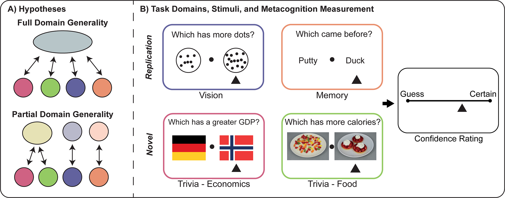
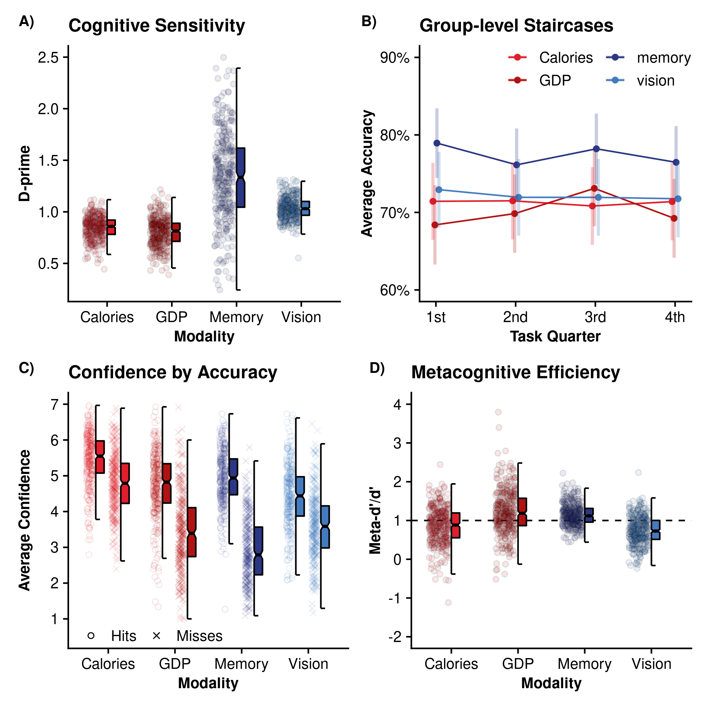
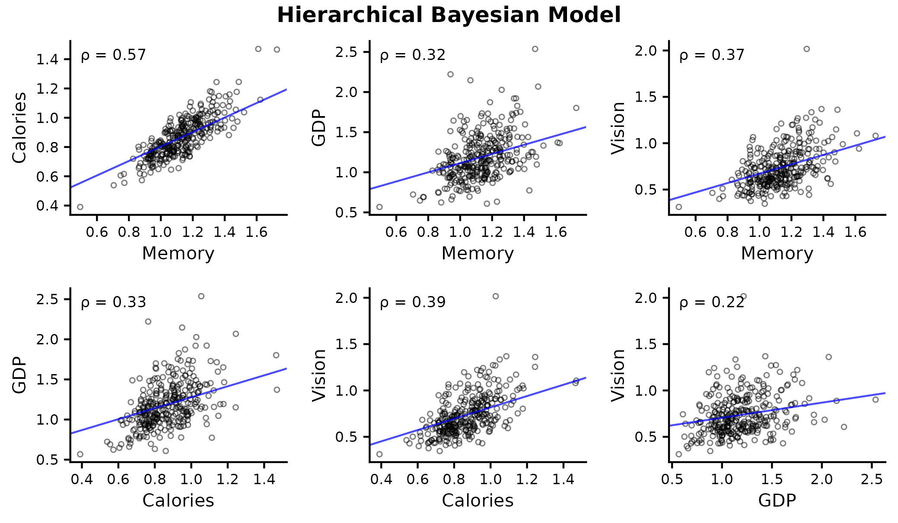
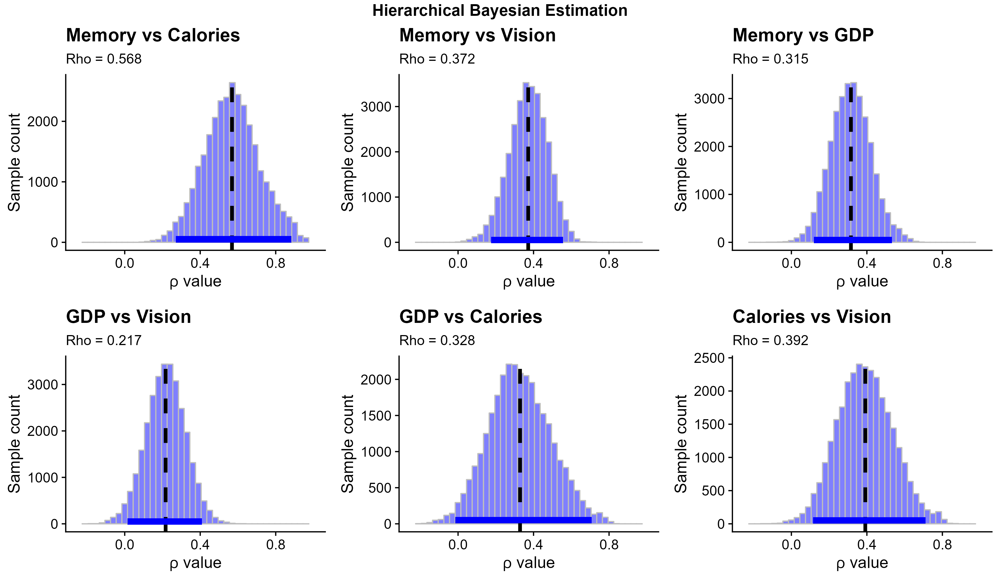
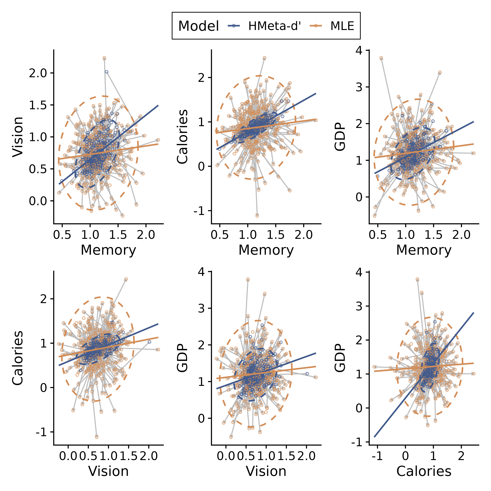

# Domain General Metacognition: A Confirmatory Study of Perceptual, Semantic, and Memory-Based Metacognition

### Abstract
Metacognition is the ability to monitor and control one's own cognitive processes, with higher- order mechanisms assessing the performance of lower-level cognitive operations to determine subjective confidence. An open question is whether metacognitive capacity is domain-general, akin to a conductor overseeing various sections of an orchestra, or whether it is inherently coupled to each domain, resembling a collection of specialized musical directors for each instrument group. Previous studies attempting to address this question have suffered from methodological drawbacks, such as a lack of control over cognitive sensitivity and low statistical power. In this confirmatory, pre-registered study, we addressed this gap by testing metacognitive ability in visual perceptual, memory, and general knowledge domains using a newly developed adaptive 'trivia' task spanning judgments about nutrition and global economics. We found substantive correlations in metacognitive bias and efficiency across domains, even when controlling for cognitive ability, suggesting up to 15-20% shared variance in metacognition across different modalities. Surprisingly however, we found the lowest correlation in metacognition between the two general knowledge domains, despite these tasks being matched on performance and surface-level features. Our results broadly support the existence of a metacognitive "g-factor," excluding several important methodological confounds; while also highlighting the importance of further research into inter-individual differences in metacognitive priors which may explain the lower correlations between the different knowledge domains.

## Preprint:

Link to [preprint](https://psyarxiv.com/p97s5)

Cite as:
Lund, A. E., Correa, C., Fardo, F., Fleming, S. M., & Allen, M. (2023, April 21). Domain Generality in Metacognitive Ability: A Confirmatory Study Across Visual Perception, Memory, and General Knowledge. Retrieved from psyarxiv.com/p97s5

## Figures

### Figure 1:
|   |
|:--:| 
| Figure 1: Testing domain generality in metacognition. |
>A) Hypotheses concerning domain generality versus specificity for metacognitive ability. The domain-general hypothesis posits that metacognition reflects a central- executive-like capacity for integrating signals across cognitive modalities, leading to a high degree of inter-domain and inter-task correlation. The domain-specific hypothesis posits that metacognition is more modular, resulting in greater independence between tasks. B) Tasks used to probe metacognitive insight across the visual, memory and general knowledge domains. The latter domain was measured using a novel trivia task which implements an adaptive staircase procedure to probe different categories of knowledge. Participants decided which of two presented countries or plates of food had more wealth or calories, respectively. To measure metacognition, for each task participants made retrospective 1-7 confidence ratings immediately following their decision. To maximize comparability, all tasks were of a 2AFC design and matched in terms of low-level, trial-wise timings and structures.

### Figure 2:
|  |
|:--:| 
| Figure 2: Cognitive and metacognitive abilities across domains. |
>A) Cognitive sensitivity (d-prime) was significantly greater in the memory and vision tasks, but equivalent in the two trivia domains concerning caloric and socioeconomic (GDP) decisions. Individual dots show subject-level d-prime estimates for each task, box plots depict medians and interquartile ranges. B) Accuracy was stabilized across the visual and trivia tasks using a two-down one-up staircase procedure converging at 71% accuracy at the limit. This stabilizing effect can also be seen in the inter- subject spread of d-prime for the three staircased tasks, whereas memory sensitivity varies substantially. Line plots depict grand mean hit-rate at each task quarter, error bars show 95% confidence interval. Bottom row shows metacognitive results for C) average confidence across hit and miss trials and D) estimated metacognitive efficiency for each task. Metacognitive efficiency is significantly better for GDP and memory judgments. Inspection of accuracy- split confidence ratings suggests that these differences arise from relative under-confidence on these modalities, as well as potential overconfidence for caloric judgments. Notably, the average confidence for incorrect caloric trials is significantly higher than that of correct GDP and memory trial ratings. Box plots depict medians and interquartile ranges, individual dots present subject-level estimates.

### Figure 3:
|  |
|:--:| 
| Figure 3: Scatter plots of pairwise associations between metacognitive abilities in different task domains: Memory, Calories, Gross Domestic Product (GDP), and Vision, estimated from the hierarchical Bayesian metacognition model. |
>Each plot shows the linear relationship between two variables with the respective rho value (ρ) displayed in the top-left corner. The blue line represents the fitted line based on the hierarchically estimated rho values. Note the individual fitted values of meta-d’/d’ undergo shrinkage towards the group mean within the hierarchical model, and all statistical inference was performed on the group mean and covariance estimates. It is interesting to observe that the relationships demonstrate varying degrees of correlation, reflecting the complex interplay among metacognitive abilities in these distinct task domains. With the exception of the GDP-calorie correlation, posterior high-density intervals indicate statistically significant correlations in all domains. See Supplementary Figure 2 for histograms of posterior samples for each pairwise Rho estimate.

### Supplementary Figure 2:
|  |
|:--:| 
| Supplementary Figure 2: Posterior Rho Samples |

>Posterior distributions of the group-level between-domain correlations in Meta-d’/d’ obtained from the hierarchical HMeta-d’ model, indicating the group-level correlation along with the 95% High Density Intervals (HDI) (blue bar). 

### Supplementary Figure 5:
|  | 
|:--:| 
| Supplementary Figure 5: Comparison of MLE and HMeta-d’ estimates of metacognitive efficiency. |

>Figure depicts the fitted individual data points for the MLE (in orange) and HMeta-d' (in blue) models. Ellipses depict the 2D gaussian probability distribution for each model’s parameter estimates, demonstrating the Bayesian shrinkage effect obtained within the HMeta-d' model in pulling noisy parameters close to the group mean. It must be noted that the HMeta-d' data points (blue dots) are subject-level estimates pulled from the hierarchically fit model, and the least-squares line fit through these data is therefore for illustration purposes only and does not reflect the actual fitted Rho values of the model (which are generally lower than those observed her’, see main Figure 3). In general, the HMeta-d' finds similar, but stronger patterns of covariation likely due to the improved signal-to-noise ratio of metacognitive efficiency estimates.
