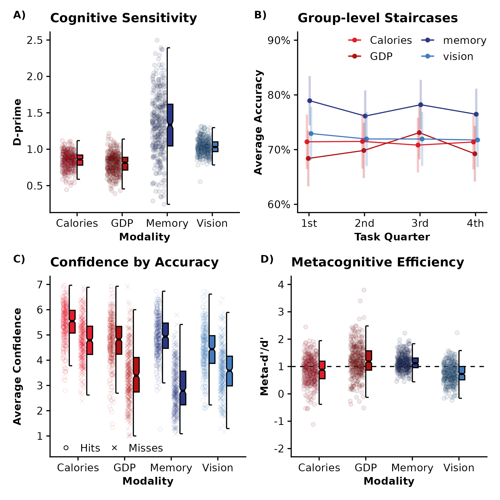
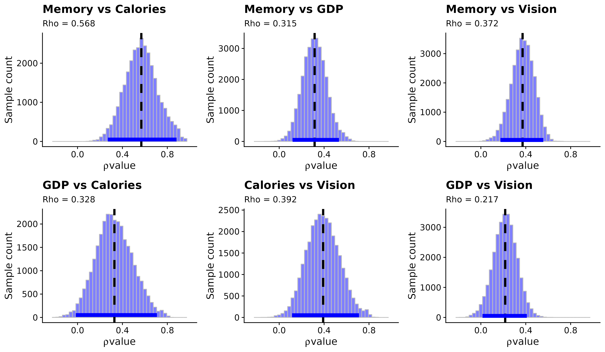

# Domain General Metacognition: A Confirmatory Study of Perceptual, Semantic, and Memory-Based Metacognition

### Figure 1:

### Figure 2:

### Figure 3:

### Supplementary Figure 2:

### Supplementary Figure 5:

